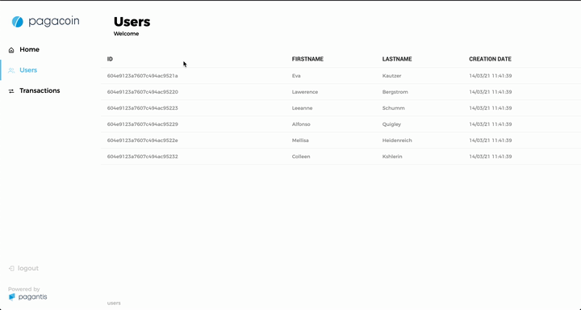
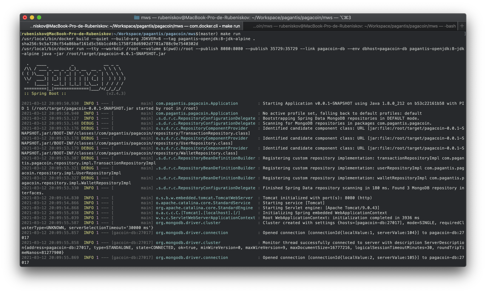

# Building the backend service

```shell
$ make build
```

# Run in local environment

```shell
$ make <run|dev|build> DC=
```

# Pagacoin React app

[](./app)

# Pagacoin Springboot Microservice
[](./mws)