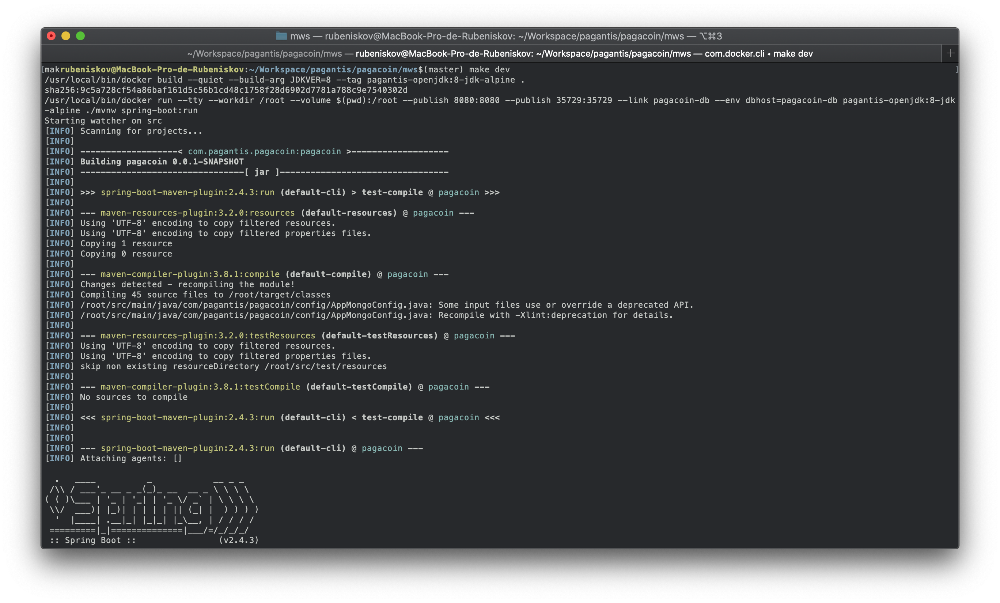
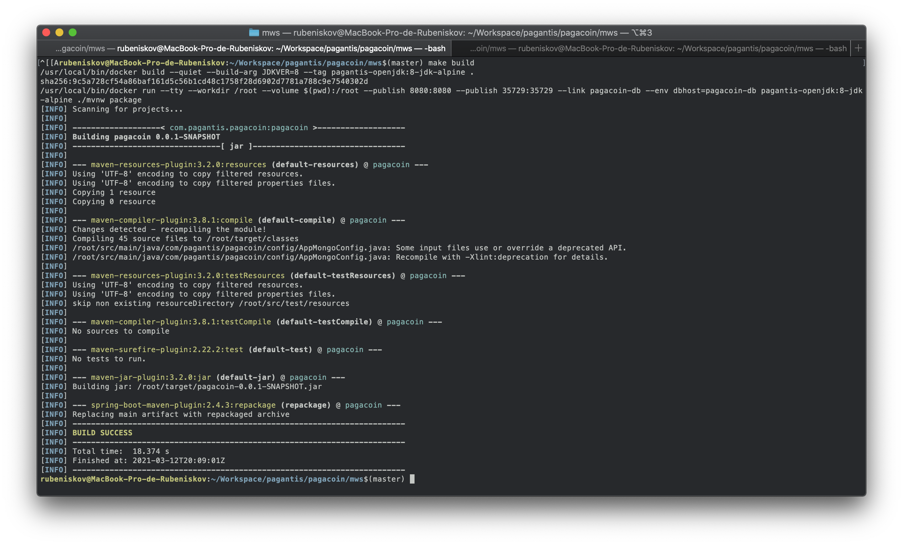
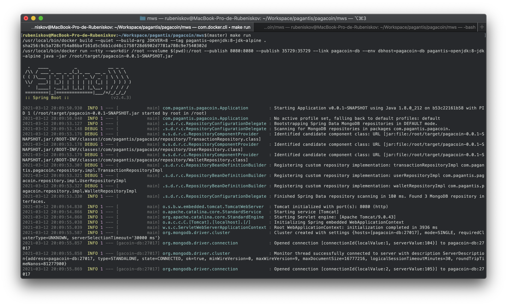
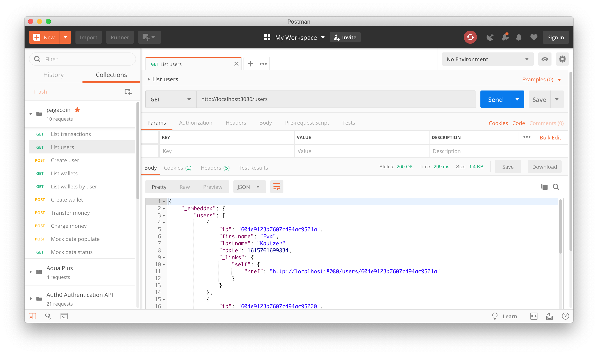

# Pagacoin Micro Web Service
## Development

```
$ make dev
```


```
$ make build
```


```
$ make run
```


All the above commands can be performanced in local enviroment instead of using docker if you pass DC='' to make

Ex:

```
$ make dev DC='';
```

## Misc

There is a postman collection available to inspect the api endpoints on `postman` directory.



